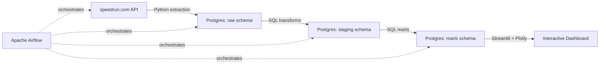

# 🏃 Speedrun World Record Data Pipeline

An end-to-end data engineering project that extracts, transforms, orchestrates, 
and visualizes world record data from [speedrun.com](https://speedrun.com) 
across 10 popular games — built with Python, PostgreSQL, Apache Airflow, and 
Streamlit.

**[Live dashboard preview →](docs/screenshots/Full dashboard view.png)**

## Why This Project

Most beginner data engineering portfolios pull from the same handful of 
datasets. This project uses speedrunning world record data instead — a genuinely 
unusual domain that still requires every core DE skill: API extraction with 
pagination and rate limits, idempotent loading, SQL transformation, 
orchestration, and a real dashboard on top.


## Architecture



## Tech Stack

- **Extraction:** Python (requests, retry/backoff logic)
- **Storage:** PostgreSQL
- **Transformation:** SQL (staging views + analytical marts)
- **Orchestration:** Apache Airflow (daily schedule, retries, failure alerting)
- **Dashboard:** Streamlit + Plotly
- **Environment:** Docker Compose

## Features

- 🏆 World record progression tracking (window-function-based, with a documented 
  timestamp-precision bug fix)
- 🌍 Runner geography choropleth map
- 📊 Community activity trends over time
- 🚀 Cross-game "most improved" leaderboard
- 🔍 Global search across all games/categories/players
- ⏱️ Computed insight metrics (days since last WR, average days between records)
- 📥 CSV export

## Data Scope

- 10 games, ~70,000 verified runs, ~1,500 enriched players (of ~15,700 total — 
  see [DECISIONS.md](docs/DECISIONS.md) for the sampling rationale)
- One category (Celeste "Any%") hits the speedrun.com API's known 10,000-offset 
  pagination limit — a documented, accepted data limitation

## Setup

```bash
git clone <your-repo-url>
cd speedrun-data-pipeline
docker-compose up -d

# Create schema (first run only)
docker exec -i speedrun_postgres psql -U speedrun_admin -d speedrun_db < sql/00_create_raw_tables.sql
docker exec -i speedrun_postgres psql -U speedrun_admin -d speedrun_db < sql/01_create_raw_runs.sql
docker exec -i speedrun_postgres psql -U speedrun_admin -d speedrun_db < sql/02_create_raw_players.sql

# Register the Airflow Postgres connection
docker exec airflow_scheduler airflow connections add speedrun_postgres \
  --conn-type postgres --conn-host postgres --conn-schema speedrun_db \
  --conn-login speedrun_admin --conn-password speedrun_pass --conn-port 5432
```

Trigger the `speedrun_pipeline` DAG from the Airflow UI (`localhost:8080`) to 
run the full extraction → transformation chain, then:

```bash
cd dashboard
python3 -m streamlit run app.py
```

## What I Learned

- Building resilient API extraction (pagination, rate limits, retries) against 
  a real, imperfect third-party API
- Debugging a subtle window-function bug caused by date vs. timestamp precision
- Orchestrating a multi-stage pipeline in Airflow, including task dependencies, 
  scheduling, retries, and failure alerting
- Running a full clean-slate rebuild test that surfaced three real 
  reproducibility gaps invisible to incremental testing alone
- Building a genuinely polished, custom-themed dashboard rather than relying 
  on default styling

## Project Log

Full day-by-day build log, decisions, and debugging stories: 
[docs/DECISIONS.md](docs/DECISIONS.md)